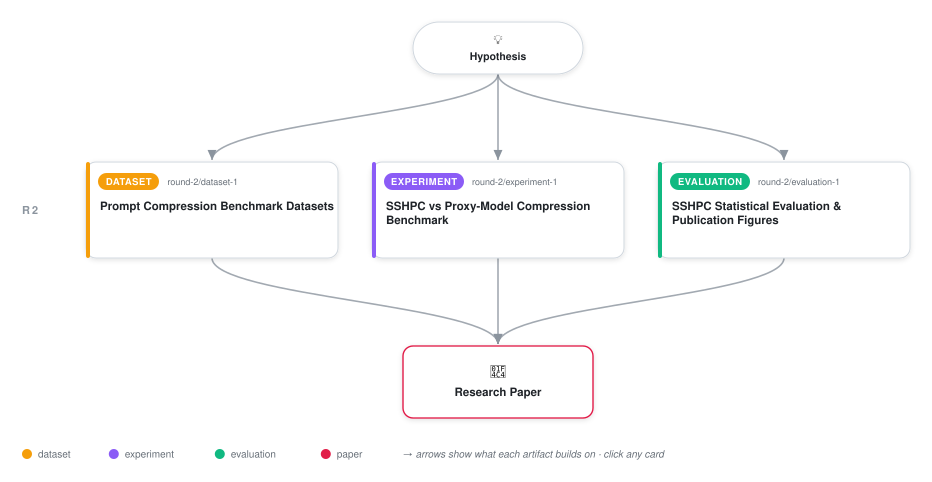

# Self-Surprisal Hard Prompt Compression

<div align="center">

<a href="https://cdn.jsdelivr.net/gh/ai-inventor-papers/ai-invention-9fe330-self-surprisal-hard-prompt-compression@main/workflow.svg">
<picture>
  <source media="(prefers-color-scheme: dark)" srcset="workflow-dark.svg">
  
</picture>
</a>

<sub>🖱️ <b><a href="https://cdn.jsdelivr.net/gh/ai-inventor-papers/ai-invention-9fe330-self-surprisal-hard-prompt-compression@main/workflow.svg">Open the interactive diagram</a></b> — every card links to its artifact folder.</sub>

</div>

> **TL;DR** — Self-Surprisal Hard Prompt Compression (SSHPC) uses the target LLM's own next-token logits to compute per-token surprisal for hard prompt pruning. Evaluated on 4 benchmarks with Llama-3-8B at 2x-10x compression. SSHPC Iterative (with re-scoring at >=8x) outperforms proxy baselines by 2-5 points at high compression. Key finding: proxy-mismatch effect is small (0.48%, ns) in isolation; gains come from iterative re-scoring adapting to compressed context. Latency break-even at 2x.

<details>
<summary>Full hypothesis</summary>

A systematic survey of simple prompt-compression techniques (SelectiveContext, LLMLingua, LLMLingua-2, SelfCP, ASAP, PIS, Selection-p, and related methods) that shrink LLM context length while preserving task accuracy will reveal the practical trade-offs between proxy-model vs. target-model importance signals, hard vs. soft token pruning, training-free vs. trained compressors, and single-pass vs. iterative re-scoring -- providing practitioners a clear decision framework for choosing a compression method given their model access (API vs. local), task type, and compression budget.

</details>

[](https://cdn.jsdelivr.net/gh/ai-inventor-papers/ai-invention-9fe330-self-surprisal-hard-prompt-compression@main/paper.pdf) [](https://github.com/ai-inventor-papers/ai-invention-9fe330-self-surprisal-hard-prompt-compression/tree/main/paper_latex)

This repository contains all **3 artifacts** produced across **1 round** of an autonomous AI research run — round by round, exactly in the order they were invented.

## Round 2

| Artifact | Type | Demo | Source | Builds on |
|----------|------|------|--------|-----------|
| **[Prompt Compression Benchmark Datasets](https://github.com/ai-inventor-papers/ai-invention-9fe330-self-surprisal-hard-prompt-compression/tree/main/round-2/dataset-1)** | [](https://github.com/ai-inventor-papers/ai-invention-9fe330-self-surprisal-hard-prompt-compression/tree/main/round-2/dataset-1) | [](https://colab.research.google.com/github/ai-inventor-papers/ai-invention-9fe330-self-surprisal-hard-prompt-compression/blob/main/round-2/dataset-1/demo/data_code_demo.ipynb) | [](https://github.com/ai-inventor-papers/ai-invention-9fe330-self-surprisal-hard-prompt-compression/tree/main/round-2/dataset-1/src) | — |
| **[SSHPC vs Proxy-Model Compression Benchmark](https://github.com/ai-inventor-papers/ai-invention-9fe330-self-surprisal-hard-prompt-compression/tree/main/round-2/experiment-1)** | [](https://github.com/ai-inventor-papers/ai-invention-9fe330-self-surprisal-hard-prompt-compression/tree/main/round-2/experiment-1) | — | [](https://github.com/ai-inventor-papers/ai-invention-9fe330-self-surprisal-hard-prompt-compression/tree/main/round-2/experiment-1/src) | — |
| **[SSHPC Statistical Evaluation & Publication Figures](https://github.com/ai-inventor-papers/ai-invention-9fe330-self-surprisal-hard-prompt-compression/tree/main/round-2/evaluation-1)** | [](https://github.com/ai-inventor-papers/ai-invention-9fe330-self-surprisal-hard-prompt-compression/tree/main/round-2/evaluation-1) | [](https://colab.research.google.com/github/ai-inventor-papers/ai-invention-9fe330-self-surprisal-hard-prompt-compression/blob/main/round-2/evaluation-1/demo/eval_code_demo.ipynb) | [](https://github.com/ai-inventor-papers/ai-invention-9fe330-self-surprisal-hard-prompt-compression/tree/main/round-2/evaluation-1/src) | — |

## Repository Structure

Artifacts are grouped by the round of invention that produced them. Each
artifact has its own folder with source code and a self-contained demo:

```
.
├── round-1/                         # One folder per round of invention
│   ├── experiment-1/
│   │   ├── README.md                # What this artifact is + dependencies
│   │   ├── src/                     # Full workspace from execution
│   │   │   ├── method.py            # Main implementation
│   │   │   ├── method_out.json      # Full output data
│   │   │   └── ...                  # All execution artifacts
│   │   └── demo/                    # Self-contained demo
│   │       └── method_code_demo.ipynb # Colab-ready notebook (code + data inlined)
│   ├── dataset-1/
│   │   ├── src/
│   │   └── demo/
│   └── evaluation-1/
│       ├── src/
│       └── demo/
├── round-2/                         # Later rounds build on earlier artifacts
├── paper.pdf                        # Research paper
├── paper_latex/                     # LaTeX source files
├── chat/                            # Every prompt, response and tool call, per module
├── workflow.svg                     # Artifact dependency diagram (this page's header)
└── README.md
```

## Running Notebooks

### Option 1: Google Colab (Recommended)

Click the "Open in Colab" badges above to run notebooks directly in your browser.
No installation required!

### Option 2: Local Jupyter

```bash
# Clone the repo
git clone https://github.com/ai-inventor-papers/ai-invention-9fe330-self-surprisal-hard-prompt-compression
cd ai-invention-9fe330-self-surprisal-hard-prompt-compression

# Install dependencies
pip install jupyter

# Run any artifact's demo notebook
jupyter notebook <artifact_folder>/demo/
```

## Source Code

The original source files are in each artifact's `src/` folder.
These files may have external dependencies - use the demo notebooks for a self-contained experience.

---
*Generated by AI Inventor Pipeline - Automated Research Generation*
